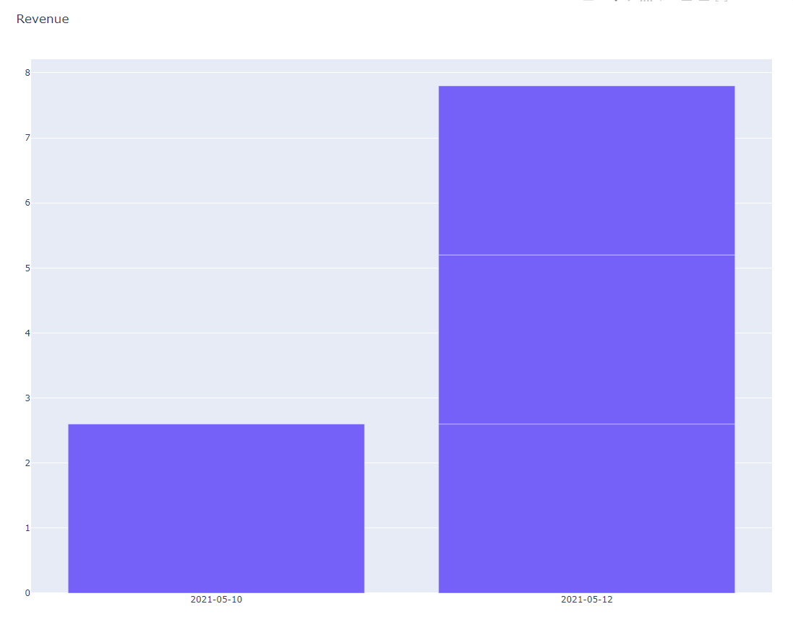

# Superpy

Supermarket management made easy.

-----

## Description
Superpy can be used as a command-line tool for a supermarket to keep record of their inventory through bought and sold products. The core functionality is about keeping track and producing reports on various kinds of data.
With this command-line tool the employee’s (or you) will be able to add bought and sold products to specific lists and see the revenue, profit and inventory on certain dates or within certain timespans.

## Usage

There are four basic types of commands:

- Buy
- Sell
- Report
- Advance

Each of these commands have a few arguments that you can supply in order to get the data you need.

### Buy

The buy command expects you to enter the product_name, buy_price and expiration_date arguments as follows:

`python main.py buy --product-name potato --price 1.2 --expiration-date 2021-05-12`

This will enter a new product into your inventory. If succesful it will return the following:

`Product has been added to the inventory.`

### Sell

The sell command expects you to enter the bought_id and sell_price arguments as follows:

`python main.py sell --bought-id 1 --price 2.6`

If succesful it will return the following:

`Product has been removed from the inventory.`
If it can not find the product with the specified bought_id, it will return the following:

`Error: Product not found in the inventory.`

### Report

With report you can check your current or past revenue, profit and inventory. 

#### Revenue
`python main.py report --report-type revenue`

Example result:

`Today's revenue is: 10.4`


#### Revenue Chart

This opens a browser window which displays a chart of the revenue per day.

`python main.py report --report-type revenue_chart`

Example result:



#### Profit
`python main.py report --report-type profit`

Example result:

`Today's profit is: 9.2`

#### Inventory
`python main.py report --report-type inventory`

Example result:
```
┏━━━━┳━━━━━━━━━━━━━━┳━━━━━━━━━━━━┳━━━━━━━━━━━┳━━━━━━━━━━━━━━━━━┓
┃ Id ┃ Product Name ┃ Buy Date   ┃ Buy Price ┃ Expiration Date ┃
┡━━━━╇━━━━━━━━━━━━━━╇━━━━━━━━━━━━╇━━━━━━━━━━━╇━━━━━━━━━━━━━━━━━┩
│ 1  │ potato       │ 2021-05-10 │ 1.2       │ 2021-05-12      │
│ 3  │ orange       │ 2021-05-10 │ 5.12      │ 2021-05-14      │
│ 5  │ strawberry   │ 2021-05-11 │ 3.52      │ 2021-05-15      │
```
#### Optional Commands

The commands will always take the current date as the default, unless specified through one of the following optional arguments:

**Yesterday**

`--yesterday`

Returns the data from yesterday.

Example:

`python main.py report --report-type inventory --yesterday`

**Date**

`--date`

Returns the data from a specific date. This has to be formatted in YYYY-MM-DD format, but can also be just the Year (YYYY) and/or Month (YYYY-MM) **unless** it is used in combination with inventory, inventory can only accept complete dates.

Examples:

`python main.py report --report-type revenue --date 2021-05-10`

`python main.py report --report-type revenue --date 2021-05`

`python main.py report --report-type revenue --date 2021`

### Advance

Superpy has an internal date. On the first run, this date will be set to your current date. However, this date can be advanced through the associated argument:

`--advance-time`

This argument expects a number corresponding to the amount of days you wish to skip forward.

Example:

`python main.py advance --advance-time 1`

## Additional Information

### Imports

Imports needed for this command-line tool are:
- argparse
- csv
- rich (print)
- rich.table (Table)
- datetime (datetime, timedelta)
- pathlib (Path)
- plotly.graph_objects
- pandas (read_csv)

### Functions

#### Function main

This function is the entry function and parses the command-line arguments. It calls the associated functions depending on the arguments.

#### Function get_internal_date

This function gets the internal date as written to the file. If the file does not exist it will create a new file and write the current date.

#### Function set_internal_date

This function writes the internal date.

#### Function write_buy_to_csv

Function which transfers the data the employee (or you) fills in to the CSV-file bought.csv. Here the data is stored in six columns. De six columns consist of an Id-number, product name, buy date, buy price, expiration date and sell date. The employee (or you) needs to give the product name, the buy price and the expiration date in the command-line. 

The id-number (see “# Gives Id-number to bought products.”) and buy date (by using “global current_date” and “current_date.strftime(‘%Y-%m-%d’)”) are automatically given by the function.
The sixth column is provided by the function write_sell_to_csv or otherwise left empty.

#### Function write_sell_to_csv

Function which transfers the data the employee (or you) fills in to the CSV-file sold.csv. 
Here the data is stored in five columns. These columns consist of Id-number, bought Id, product name, sell date and sell price. The employee (or you) needs to give the bought Id and the sell price in the command-line.

The Id-number (see “# Gives Id-number to sold products.”), the bought Id (see “# Get associated bought Id.”) and the sell date (by using “global current date” and “current_date.strftime(‘%Y-%m-%d’)”) are automatically given by the function.

If the employee (or you) fills in a product name that doesn’t exist in the bought.csv, an error will pop up with the text: “Error: Product not found in the inventory”.

#### Function report_revenue

This function provides the employee (or you) with a report of the revenue. The function gets this data by adding the prices of the sold products (in the sold.csv file) within a certain period of time.The employee (or you) does this by typing in the command line the date, day or span of time of which the employee (or you) wants to know the revenue of.

When this is done a line will be given back with the revenue: “ [date]’s revenue is: [revenue amount].”.

#### Function show_revenue_chart

This function does the same as the function report_revenue but shows it in a chart instead of a single sentence. This way the employee (or you) can check the revenue over several periods of time at the same time. It will create a bar for everyday it can find in the sold.csv file.

#### Function report_profit

This function provides the employee (or you) with a report of the profit. The function gets this data by adding the prices of the sold products minus the added buyprices of those products within a certain period of time. It gets this data from both the bought.csv file and the sold.csv file. The employee (or you) does this by typing in the command-line the date, day or span of time of which the employee (or you) wants to know the profit of.

When this is done a line will be given back with the profit: “ [date]’s profit is: [profit amount].”.

#### Function report_inventory

This function provides the employee (or you) with a report of the inventory. The function gets this data by showing only the products that haven’t got a sell date (see # Bought products minus sold items.”) in the bought.csv file and from which the expiration date hasn’t been yet (see # Remove expired products from inventory,”). The employee (or you) does this by typing in the command-line the date or day of which the employee (or you) wants to know the inventory of.

The inventory will be given in the form of a table in which the Id-number, product name, buy date, buy price and expiration date are shown.

### CSV-Files

To get the functions to work I use CSV-files. In this case two:

#### Bought.csv

In bought.csv you can find all data concerning the products the supermarket bought. The data is written to this file with the function write_buy_to_csv.
A filled in row in bought.csv can look like this;

**1,potato,2021-05-07,1.2,2021-05-09,2021-05-07
2,potato,2021-05-07,1.2,2021-05-09,**

It consists of six columns:
- Column 1: **Bought Id** -- The function write_buy_to_csv gives an Id-number to the products that you add. This number will be shown in the first column and the function should be adding the number with one each time a new product is being bought.
- Column 2: **Product name** -- In column two the name of the product is shown. This name will be given by the supermarket-employee (or you).
- Column 3: **Buy date** -- Column three will show the date on which the supermarket bought the product. The employee (or you) won’t need to fill this in, the function write_buy_to_csv will do it for you automatically.
- Column 4: **Buy price** -- Here the price for which the supermarket bought the product for shows. This price must be given by the supermarket employee (or you).
- Column 5: **Expiration date** -- Column five will show the date on which the bought product will expire. This date must be given by the employee (or you).
- Column 6: **Sold date** -- This column works a bit differently from the rest because this one is added to by the function write_sell_to_csv. It shows on which date the product is sold. This way the product also will not show if you ask for an inventory report. This date is added by the employee (or you). If the product is not yet sold, the column will be empty.

The other functions use the data in bought.csv to make reports. One function that uses mostly the data from bought.csv is report_inventory.

#### Sold.csv

In sold.csv you can find all data concerning the products the supermarket bought. The data is written to this file with the function write_sell_to_csv.
A filled in row in sold.csv can look like this;

**1,1,potato,2021-05-07,2.6**

It consists of five columns:
- Column 1: **Sold Id** -- The function write_sell_to_csv gives an Id-number to the products that you add. This number will be shown in the first column and the function should be adding the number with one each time a new product is being bought.
- Column 2: **Bought Id** -- This is the Id-number that the function write_buy_to_csv gave to the product when it was bought. You need this number to tell column six in bought.csv that the product sold and on which date. The employee (or you) needs to fill this in.
- Column 3: **Product name** -- In column two the name of the product is shown. This name will be given by the supermarket-employee (or you).
- Column 4: **Sold date** -- Column four will show the date on which the supermarket sold the product. The employee (or you) won’t need to fill this in, the function write_sell_to_csv will do it for you automatically.
- Column 5: **Sell price** -- Here the price for which the supermarket sold the product for shows. This price must be given by the supermarket employee (or you).

Just as the other functions use the data from bought.csv, so will they use the data from sold.csv to make reports.


-----
